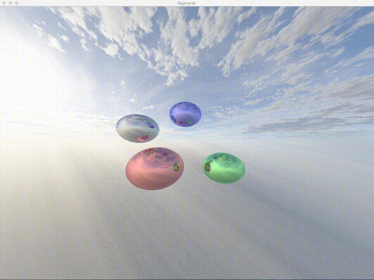

# Raytracer

GPU raytracer bootstrapped with gfx-rs.

## Preview

## TODO

- [x] Basic raytracing
- [x] Esc quit
- [x] Skybox
- [ ] Textured spheres

## Run
`cargo run --release`

## External asset licence list

* Skybox: [texture](https://opengameart.org/content/clouds-skybox-1) Public license

## Reference:

Skrolli 4/2017 magazine raytracer tutorial
